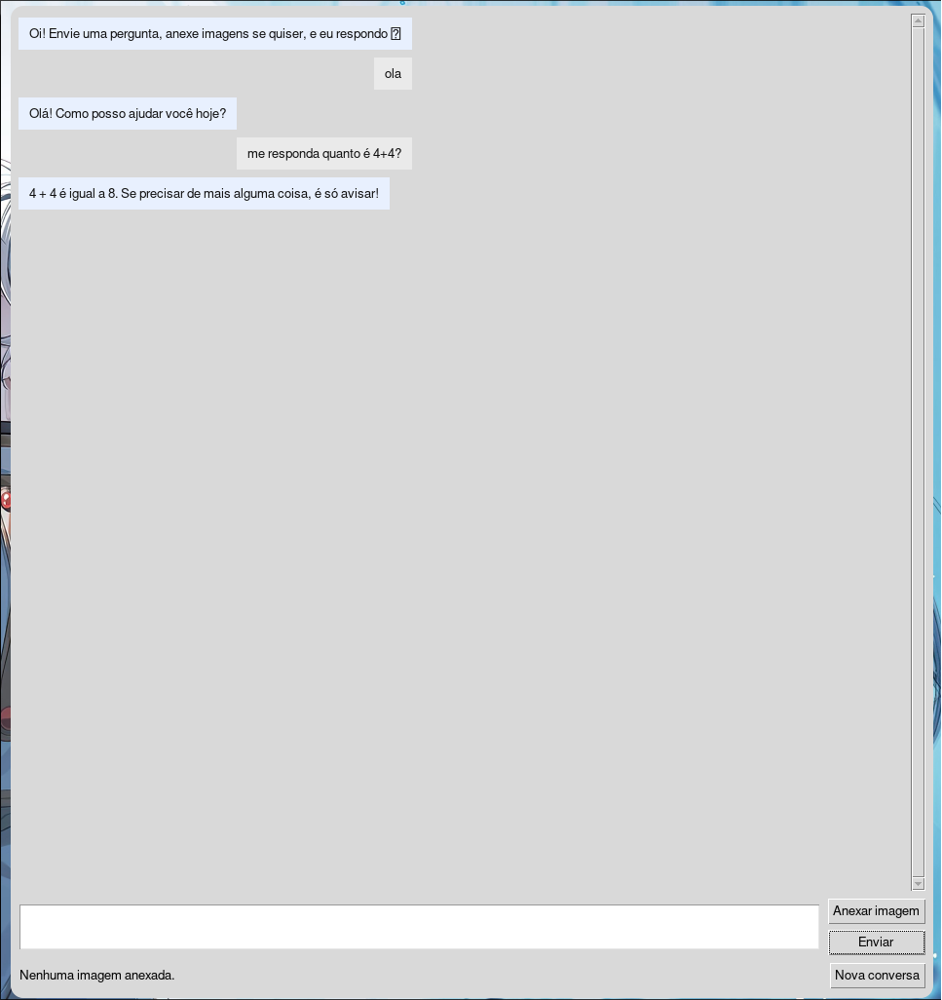

# Chatbot Multimodal Desktop (Python + Tkinter + OpenAI)

[](https://www.python.org/)
[](https://docs.python.org/3/library/tkinter.html)
[](https://python-pillow.org/)
[](https://platform.openai.com/)
[](./LICENSE)

Aplicativo desktop focado em **clareza técnica** e **facilidade de auditoria**: envie **texto + múltiplas imagens** e receba respostas do modelo `gpt-4o-mini`.  
O projeto prioriza UX estável (UI não congela), simplicidade do fluxo e práticas seguras para chaves e dados.

> **Por quê?** Ferramentas multimodais costumam vir acopladas a muita complexidade. Aqui, o objetivo é um cliente leve, direto, com decisões de engenharia transparentes e fáceis de modificar.

---

## Visão geral (sem enrolação)

- **UI**: `Tkinter + ttk`, chat rolável, thumbnails de anexos, atalho **Ctrl+Enter**.  
- **Networking**: `requests` chamando `/v1/chat/completions` em **thread** separada → a UI permanece responsiva.  
- **Imagens**: redimensionadas para até **1280×1280**, convertidas para **RGB** e enviadas como **data URL base64** (`image/jpeg`).  
- **Histórico**: trimming automático (mantém `system` + últimos N turnos) para controlar **contexto/custo**.  
- **Segurança**: chave via `SENHA.py` **ou** variável de ambiente `OPENAI_API_KEY`; `.gitignore` ignora segredos.  
- **Portabilidade**: detecção da pasta **Downloads** no Linux com `xdg-user-dir`, com **fallback** em qualquer SO.

> Ponto de entrada sugerido: **`AGENTE_IA_API_OPENAI/Agente_IA_LINUX_G.py`** (ajuste o caminho conforme seu repositório).

---

## Stack e decisões de engenharia

### 1) UI com Tkinter
- Loop de eventos único do Tkinter; nenhuma chamada **bloqueante** roda na thread principal.  
- Pré-visualização: `Pillow` cria miniaturas com `Image.thumbnail(...)` e exibe com `ImageTk.PhotoImage`.  
- Ajustes de UX: `Ctrl+Enter` envia, botão “Nova conversa”, indicador de anexos pendentes, **scroll** automático.





### 2) Concorrência: threading + `after(...)`
- A requisição HTTPS roda em `threading.Thread`.  
- Quando a resposta chega, usamos `self.after(0, callback)` para **voltar** ao *main loop* com segurança e atualizar a UI.  
- **Por quê não async/await?** Tkinter não é *async-first* e threading é simples e previsível aqui.

### 3) Manipulação de imagem (teoria + prática)
- Resize **proporcional** até `1280×1280` → **menos latência** e **menos tokens** consumidos na API.  
- Conversão para **RGB** evita problemas de modo (`"P"`, `"RGBA"`, etc.).  
- Exportação para **JPEG** (qualidade 85, `optimize=True`) → bom compromisso entre tamanho e fidelidade.  
- Envio como **data URL base64** (`data:image/jpeg;base64,...`) simplifica payload e evita depender de hosting de arquivos.  
- **Detalhe importante**: ao abrir a imagem, copiamos (`im.copy()`) e **fechamos** imediatamente o handle para evitar *file locks*.

### 4) Chat multimodal (formato do payload)
- Endpoint: **`/v1/chat/completions`**.  
- Cada mensagem `user` pode conter **múltiplos** itens no `content`:  
  ```json
  {
    "role": "user",
    "content": [
      { "type": "text", "text": "Explique esta derivada." },
      { "type": "image_url", "image_url": { "url": "data:image/jpeg;base64,/9j/4AAQ..." } },
      { "type": "image_url", "image_url": { "url": "data:image/jpeg;base64,/9j/4QeN..." } }
    ]
  }
  ```
- Opções usadas por padrão:
  - `model = "gpt-4o-mini"`  
  - `temperature = 0.7`  
  - `max_tokens = 700`  
- **Histórico**: o trimming evita “conversas infinitas” no contexto. A lógica mantém 1 `system` + os últimos *N* turnos configuráveis.

### 5) Tratamento de erros e *edge cases*
- Captura diferenciada de `HTTPError` (exibe **status code** e início do `response.text`), `RequestException` (timeout, DNS, etc.) e exceções genéricas.  
- Mensagens de UI usando `messagebox` com feedback direto.  
- Botões de Enviar/Anexar são **desabilitados** durante a chamada e **reativados** ao final (sucesso ou falha).

### 6) Segurança e chaves
- `SENHA.py` **não** vai para o Git (ver `.gitignore` abaixo).  
- Fallback para `OPENAI_API_KEY` via variável de ambiente.  
- **Recomendação**: em produção/CI, prefira variável de ambiente; em máquina local, `SENHA.py` é OK.

---

## Instalação (Linux/Arch-friendly)

**Dependências do sistema**
```bash
# Tkinter (biblioteca do sistema)
sudo pacman -S tk            # Arch/Manjaro
# sudo apt-get install python3-tk  # Ubuntu/Debian

# (Opcional) utilitário para resolver pasta Downloads
sudo pacman -S xdg-user-dirs
```

**Ambiente Python**
```bash
git clone https://github.com/<usuario>/<repo>.git
cd <repo>

python -m venv .venv
source .venv/bin/activate        # Linux/macOS
# .venv\Scripts\activate       # Windows

pip install -U pip
pip install requests pillow
```

**Configurar chave**
- **Arquivo** `SENHA.py` na raiz:
  ```python
  API_KEY = "sk-xxxxxxxxxxxxxxxxxxxxxxxx"
  ```
- **Ou** variável de ambiente:
  ```bash
  export OPENAI_API_KEY="sk-xxxxxxxxxxxxxxxxxxxxxxxx"
  ```

**Executar**
```bash
python AGENTE_IA_API_OPENAI/Agente_IA_LINUX_G.py
```

---

## .gitignore recomendado (segurança primeiro)

> Ignora tudo dentro da pasta do agente e só permite expor o arquivo principal, além de excluir segredos e *build trash*.

```gitignore
# Ignorar tudo dentro da pasta do agente
AGENTE_IA_API_OPENAI/*

# Exceto o arquivo principal público
!AGENTE_IA_API_OPENAI/Agente_IA_LINUX_G.py

# Segredos e caches
**/SENHA.py
**/.env
**/.env.*
**/__pycache__/
**/*.py[cod]
**/*.log

# Manter docs
!.gitignore
!README.md
```

---

## Configurações úteis (rápidas)

- **Modelo**: altere `MODEL = "gpt-4o-mini"` para o que você tiver disponível.  
- **Temperatura**: `0.0–1.0` (mais alto = respostas mais criativas).  
- **`max_tokens`**: controla tamanho máximo da resposta.  
- **Resize de imagem**: `image_to_data_url(..., max_w=1280, max_h=1280, quality=85)`.

```python
# Exemplo: resposta mais contida e barata
payload = {
    "model": MODEL,
    "messages": self.history,
    "temperature": 0.3,
    "max_tokens": 400,
}
```

---

## Problemas comuns (e soluções objetivas)

- **`ModuleNotFoundError: tkinter`** → instale `tk` pelo gerenciador do SO.  
- **HTTP 401/403** → checar key, permissões do modelo e variáveis de ambiente.  
- **HTTP 429** → reduzir frequência, número de imagens e/ou tamanho (resize).  
- **UI “congelando”** → garanta que a chamada HTTP permaneça na **thread** (não mova para a main thread).  
- **Payload grande (400/413)** → reduza `max_w/max_h` das imagens e/ou `max_tokens`.  
- **Thumbnails não renderizam** → verifique suporte da Pillow ao formato e possíveis *file locks* (garantido no código pelo `im.copy()`).

---

## Roadmap curto (prático)

- [ ] **Streaming** da resposta (render incremental).  
- [ ] Exportar conversa em **Markdown/JSON**.  
- [ ] Drag & drop de imagens.  
- [ ] Botão “Copiar resposta” e suporte básico a **Markdown**.  
- [ ] Limite configurável de imagens por mensagem.

---

## Arquitetura (diagrama simples)

```
[Tkinter Mainloop]
      |
      | on_send()
      v
[monta payload] --(thumbnails/UI)--> [exibe usuário]
      |
      | thread.start()  -- HTTP POST -->  /v1/chat/completions
      |                                   (texto + image_url base64)
      v
[self.after(0, finish)] <--- resposta ---/
      |
      v
[atualiza histórico + bolha assistant + reabilita botões]
```

---

## Autor

**Miguel de Castilho Gengo** 

- Estudante de **Engenharia de Computação — PUC-Campinas**

**Experiências e focos (2024–2025)**  
- Arquiteturas distribuídas com **ROS 2**; **controle de robôs em tempo real**.  
- **Automação e algoritmos em Python** para desafios computacionais.  
- **Interfaces gráficas em Java** com foco em usabilidade e legibilidade.  
- **Cibersegurança** em VMs isoladas (**VirtualBox**, **Kali Linux**).  
- **Sistemas automatizados inteligentes** e ambientes de teste seguros.

**Formação complementar**  
Museu da Matemática — **Prandiano**: modelagem, otimização, **análise estatística** e **raciocínio combinatório**, convertidos em **algoritmos eficientes** aplicáveis ao negócio.

**Stack & Ferramentas**  
Python • ROS 2 (Jazzy/Turtlesim) • Java (GUI) • C / Assembly x86 16-bit • Node.js • **MongoDB Atlas** • Linux (**Arch/Hyprland**) • Virtualização (**VirtualBox/KVM**) • Git/GitHub

**Interesses**  
Robótica, sistemas distribuídos, automação, segurança (ofensiva/defensiva), otimização matemática aplicada, engenharia de dados para telemetria/controle.

**GitHub**  
[github.com/Gengo250](https://github.com/Gengo250)

**LinkedIn**  
[linkedin.com/in/SEU-LINK-AQUI](www.linkedin.com/in/miguel-gengo) <!-- substitua pelo seu URL real -->

---
## Créditos e licença

- **OpenAI API** • **Pillow** • **Tkinter**  
- Recomenda-se licença **MIT** (adicione arquivo `LICENSE`).

> Sugestões e PRs são bem-vindos — mantenha mudanças pequenas e auditáveis.
